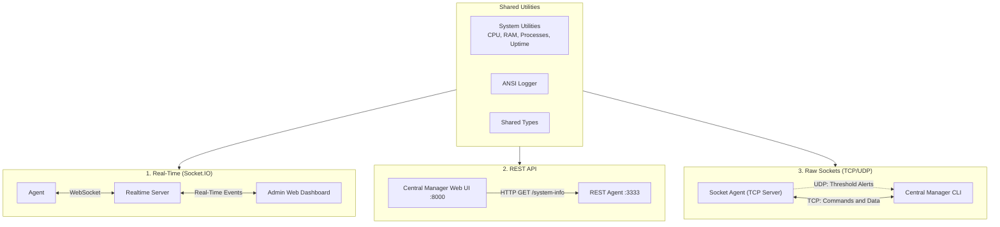

# System Monitoring Mini-Project

[](https://www.typescriptlang.org/)
[](https://nodejs.org/)
[](https://socket.io/)
[](https://expressjs.com/)

A Node.js and TypeScript mini-project that monitors system metrics (CPU usage, memory, OS information, and running processes) across machines using an **Agent and Central Manager** model.

The goal of this project is to implement the same monitoring scenario using **three different communication methods**:

1. **Real-Time (Socket.IO)**: Agents stream their CPU and memory metrics to an admin dashboard in real time within isolated rooms, supporting direct 1:1 chat and broadcast messages.
2. **REST API (Express)**: Agents expose HTTP endpoints (`/system-info`, `/reboot-system`), and the Central Manager provides a web dashboard to query and view metrics on demand.
3. **TCP / UDP Sockets (Node.js `net` & `dgram`)**: Agents run a TCP server to respond to admin commands and use UDP to send automatic alerts when system resources exceed a threshold, controlled via a terminal CLI.

---

## 🏗 Overview Diagram



---

## ⚡ How Each Version Works

### 1. Real-Time (`Realtime/`)
- Uses **Socket.IO** and **Express**.
- Agents join a designated room and stream their CPU and RAM load.
- Admin joins the same room to see all connected agents, their live metrics, and can initiate 1:1 chat or broadcast messages.
- State is managed via a dedicated `RoomManager` class to avoid global mutable state.

### 2. REST API (`REST/`)
- Uses **Express**.
- Each agent runs a lightweight API exposing `GET /system-info` and `POST /reboot-system`.
- The Central Manager provides a simple web dashboard where you enter the agent's IP and port to inspect its vitals and process list.

### 3. TCP / UDP Sockets (`Socket/`)
- Uses native Node.js `net` and `dgram` modules.
- Agents listen for TCP connections and respond to commands (`info`, `reboot`), chunking large payloads (like process lists) so they fit into network packets without truncation.
- Agents also listen in the background and send UDP alert messages if resource usage spikes above 70%.
- Central Manager is an interactive command-line interface (CLI).

---

## 📁 Project Structure

```
monitoring-app/
├── shared/                     # Shared system metric collection and logger
│   ├── system.ts               # Non-blocking CPU, memory, uptime, process utilities
│   ├── logger.ts               # Terminal logger
│   └── types.ts                # Shared TypeScript types
├── Realtime/                   # Socket.IO implementation
│   ├── src/server/             # Express & Socket.IO server with RoomManager
│   └── public/                 # Web UI (chat, admin, join screens)
├── REST/                       # REST API implementation
│   ├── Agent/                  # Express agent (:3333)
│   └── Central-Manager/        # Web dashboard (:8000)
├── Socket/                     # Native TCP/UDP implementation
│   ├── Agent/                  # TCP daemon + UDP alert sender
│   └── Central-Manager/        # Interactive CLI
├── .env.example                # Sample environment variables
├── tsconfig.base.json          # Shared TypeScript configuration
└── LICENSE                     # MIT License
```

---

## 🚀 Getting Started

### Prerequisites
- **Node.js** (v18 or higher)
- **npm**

### 1. Configure Environment Variables
Copy `.env.example` into each subproject that requires configuration:
```bash
# Realtime
cp .env.example Realtime/.env

# REST Agent & Central-Manager
cp .env.example REST/Agent/.env
cp .env.example REST/Central-Manager/.env

# Socket Agent & Central-Manager
cp .env.example Socket/Agent/.env
cp .env.example Socket/Central-Manager/.env
```

---

### 2.1 Running the Realtime (Socket.IO) Version

```bash
cd Realtime
npm install
npm run dev
```

- **Agent Panel**: Open `http://localhost:3000/` (enter your PC name and a Room ID).
- **Admin Panel**: Open `http://localhost:3000/admin.html` (enter the same Room ID to monitor connected agents).

---

### 2.2 Running the REST Version

**Start the Agent:**
```bash
cd REST/Agent
npm install
npm run dev
# Agent listens on http://localhost:3333
```

**Start the Dashboard:**
```bash
cd REST/Central-Manager
npm install
npm run dev
# Dashboard opens on http://localhost:8000
```

---

### 2.3 Running the TCP/UDP Socket Version

**Start the Agent:**
```bash
cd Socket/Agent
npm install
npm run dev
```

**Start the Central Manager CLI:**
```bash
cd Socket/Central-Manager
npm install
npm run dev
```

---

## 🧪 TypeScript Verification

All subprojects can be type-checked with:

```bash
cd Realtime && npm run build
cd ../REST/Agent && npm run build
cd ../Central-Manager && npm run build
cd ../../Socket/Agent && npm run build
cd ../Central-Manager && npm run build
```